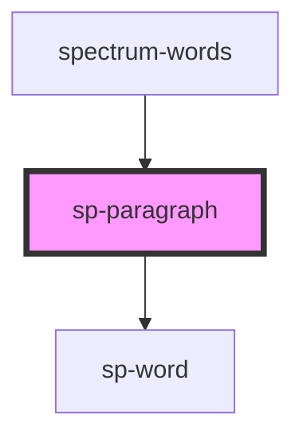

# sp-paragraph

<!-- Auto Generated Below -->

## Properties

| Property          | Attribute          | Description | Type                 | Default        |
| ----------------- | ------------------ | ----------- | -------------------- | -------------- |
| `lineSpacing`     | `line-spacing`     |             | `number`             | `undefined`    |
| `paragraphCount`  | `paragraph-count`  |             | `number`             | `2`            |
| `paragraphLength` | `paragraph-length` |             | `number[] \| string` | `[50, 60, 70]` |
| `wordColors`      | `word-colors`      |             | `string \| string[]` | `undefined`    |
| `wordHeight`      | `word-height`      |             | `number`             | `undefined`    |
| `wordRadius`      | `word-radius`      |             | `number`             | `undefined`    |
| `wordSpacing`     | `word-spacing`     |             | `number`             | `undefined`    |
| `wordWidths`      | `word-widths`      |             | `number[] \| string` | `undefined`    |

## Dependencies

### Used by

 - [spectrum-words](../spectrum-words)

### Depends on

- [sp-word](../sp-words)

### Graph

----------------------------------------------

*Built with [StencilJS](https://stenciljs.com/)*
