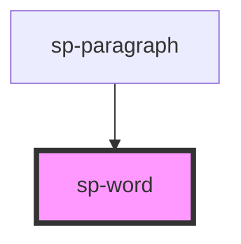

# sp-word

<!-- Auto Generated Below -->

## Properties

| Property      | Attribute      | Description | Type                 | Default     |
| ------------- | -------------- | ----------- | -------------------- | ----------- |
| `lineSpacing` | `line-spacing` |             | `number`             | `4`         |
| `wordColors`  | `word-colors`  |             | `string \| string[]` | `undefined` |
| `wordHeight`  | `word-height`  |             | `number`             | `12`        |
| `wordRadius`  | `word-radius`  |             | `number`             | `10`        |
| `wordSpacing` | `word-spacing` |             | `number`             | `2`         |
| `wordWidths`  | `word-widths`  |             | `number[] \| string` | `undefined` |

## Dependencies

### Used by

 - [sp-paragraph](../sp-paragraph)

### Graph

----------------------------------------------

*Built with [StencilJS](https://stenciljs.com/)*
